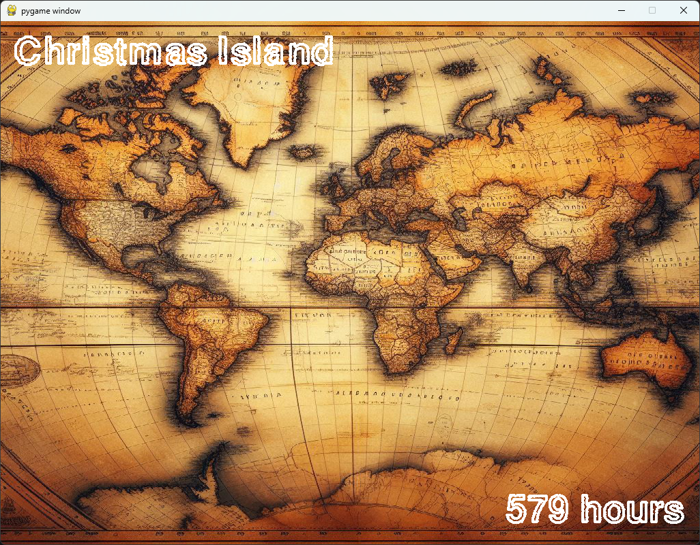
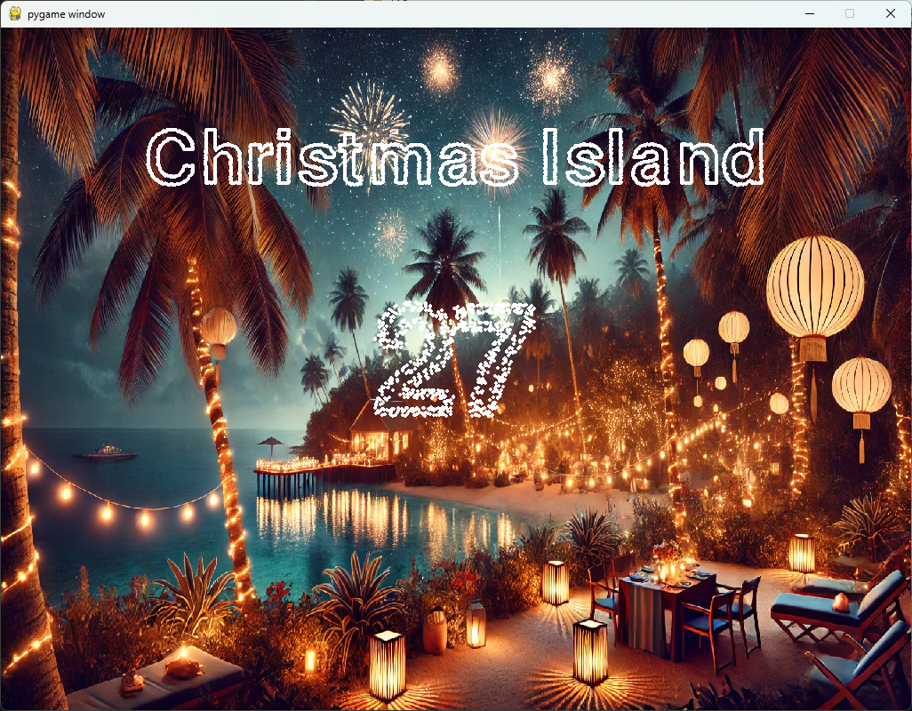
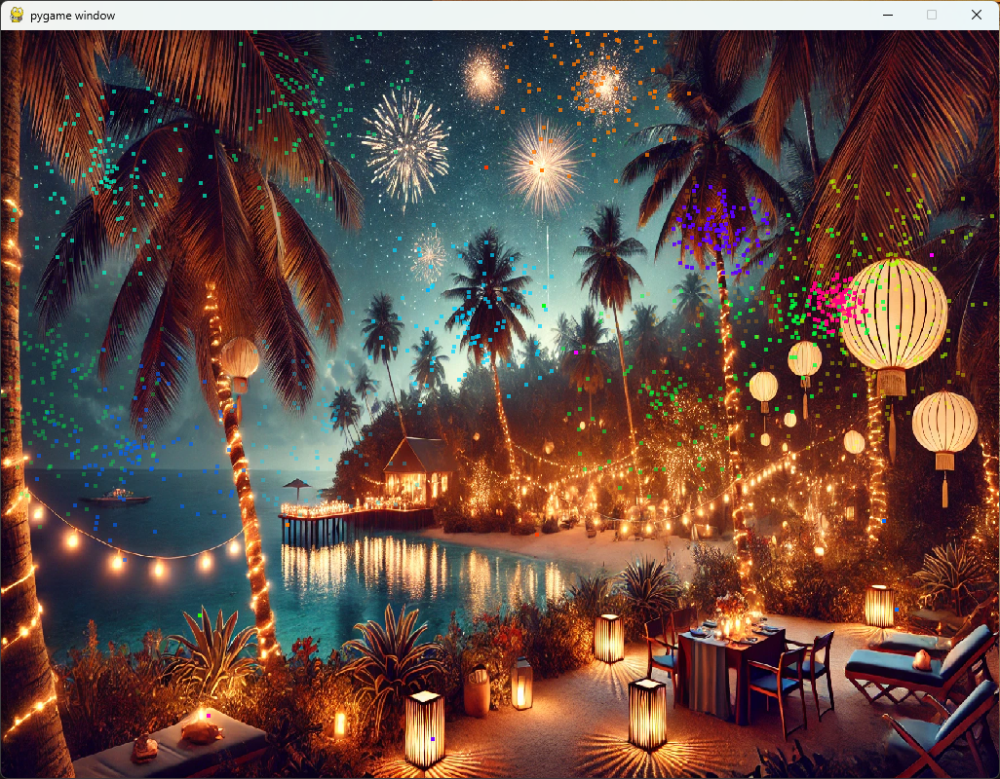

# New Year's Eve Celebration in Every Time Zone

This project is a Python-based interactive application to celebrate New Year's Eve across all time zones with countdowns, fireworks, and timezone-specific celebrations. It uses Pygame for visuals and particle effects, offering a fun and engaging way to ring in the new year.

## Features

- **Time Zone Countdown**: Displays a live countdown for each timezone
- **Dynamic Fireworks Display**: Launches fireworks during the celebration period for each timezone.
- **Interactive Controls**: Toggle fullscreen mode and debug options for customization.
- **Customizable Timezones**: Supports changing the starting timezone for countdowns.

## Prerequisites

- Python 3.12 or later
- Pygame (`pip install pygame`)

## Installation

1. Clone the repository:

   ```bash
   git clone https://github.com/DariuszLabaj/DatetimeOffsetCountdown.git
   cd new-years-eve-celebration
    ```

2. Instal the dependencies:

    ```bash
    pip install pygame
    ```

3. Place the required resources in the Resources folder:

    - Background images for each timezone named as `<timezone_name>.png`
    - A general background image named timezoneBg.jpg

## Usage

1. Run the application:

    ```bash
    python main.py
    ```

2. Use the following keyboard shortcuts:

    - `Alt + Enter`: Toggle fullscreen mode

3. Watch the countdowns for each timezone, and enjoy the fireworks during the celebration

## How It Works

1. **Setup**: The program initializes the display, sets up the timezones, and starts the countdown from the selected timezone.
2. **Countdown Logic**: For each timezone, the app calculates the time remaining and updates the display dynamically.
3. **Fireworks**: When a countdown reaches zero, fireworks are displayed to celebrate the New Year in that timezone.
4. **Transition**: The app automatically transitions to the next timezone and continues the process.

## Screenshots





> **Note: Some images included in the application are AI-generated using ChatGPT and DALL-E.**

## License

This project is licensed under the MIT License. See the [LICENSE](LICENSE.txt) file for details.

## Acknowledgements

- [Pygame](https://www.pygame.org/news) for the graphical interface.
- AI-generated images created with ChatGPT and DALL-E.
- Inspiration from global New Year celebrations.

---

Enjoy celebrating New Year's Eve, no matter where you are in the world!
